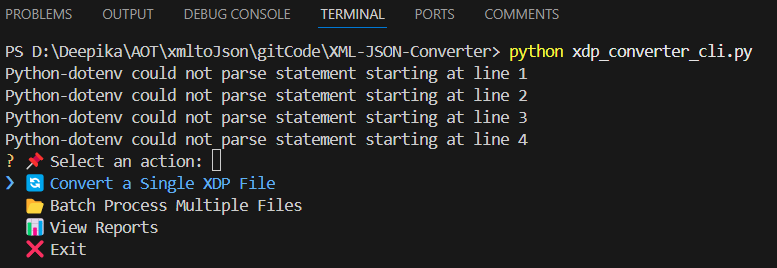
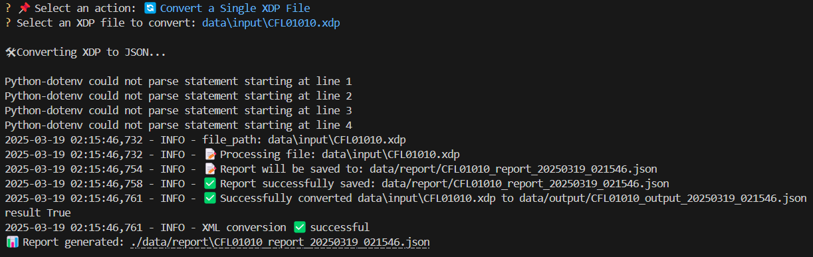
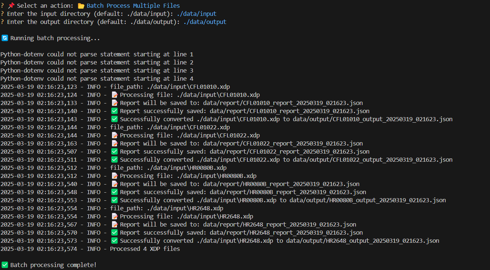
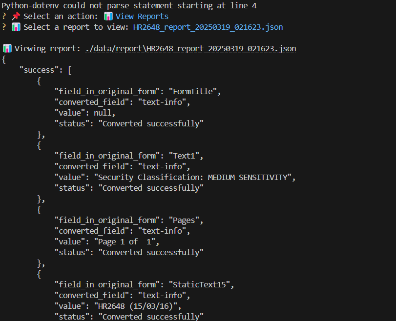

# XML to JSON Converter

## 📖 Overview
The **XML to JSON Converter** is a command-line tool designed to convert XFA-based XML forms into JSON format. It supports **single file conversion** as well as **batch processing** of multiple XML files.

---

## 🚀 Installation

To install the required dependencies, run:
```sh
pip install -r requirements.txt
```

---

## 🚀 Running the XML Converter

### **1️⃣ Main Menu**
When you run the script, you will see a menu with different options:

```sh
python xdp_converter_cli.py
```



---

### **2️⃣ Convert a Single XDP File**

- Select the option to convert a single XDP file.
- Choose the file you want to convert.
- The converted JSON and report files will be saved in the respective directories.

```sh
? Select an action: 📄 Convert a Single XDP File
```



---

### **3️⃣ Batch Process Multiple Files**

- Select the batch processing option.
- Define the input and output directories.
- The tool will process all XDP files in the input directory and generate corresponding JSON and report files.

```sh
? Select an action: 📂 Batch Process Multiple Files
```



---

## 📂 Input, Output & Report Paths

The tool uses the following environment variables (or defaults) for directory paths:

```python
INPUT_DIR = os.getenv("INPUT_DIR", "./data/input")
OUTPUT_DIR = os.getenv("OUTPUT_DIR", "./data/output")
REPORT_DIR = os.getenv("REPORT_DIR", "./data/report")
```

- **Input Directory**: `./data/input` (Contains the XML/XDP files to be converted)
- **Output Directory**: `./data/output` (Converted JSON files are stored here)
- **Report Directory**: `./data/report` (Conversion reports are stored here)

---

## 📄 Report Generation
After conversion, a detailed report is generated for each file. The report includes:

- ✅ **Successful conversions**
- ❌ **Errors encountered**
- ⚠️ **Cases requiring manual intervention**

The report is saved in the **report directory**.



---

## 📄 Additional Documentation
For a detailed explanation of reports and error handling, refer to the full documentation.

---

### 🔗 **Contributors & Support**
If you encounter any issues, feel free to reach out or submit a pull request!

Happy Coding! 🚀

