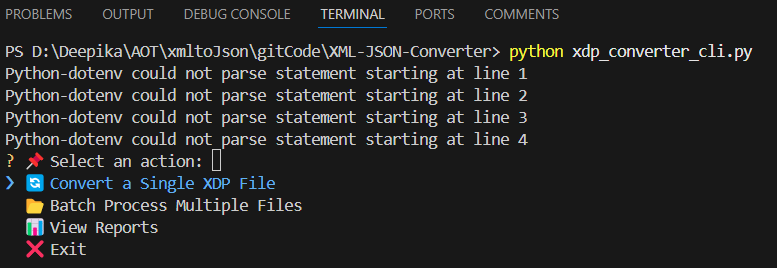
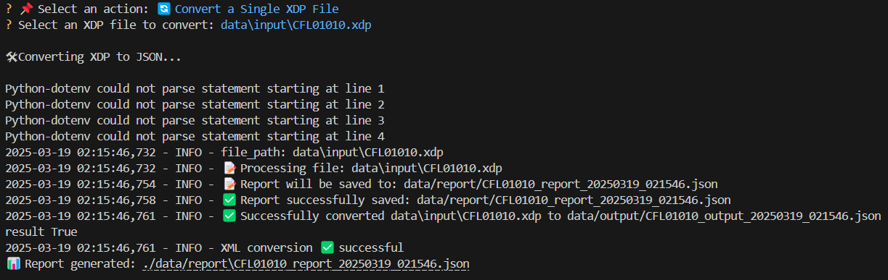
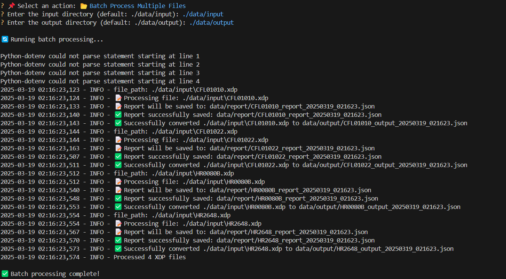
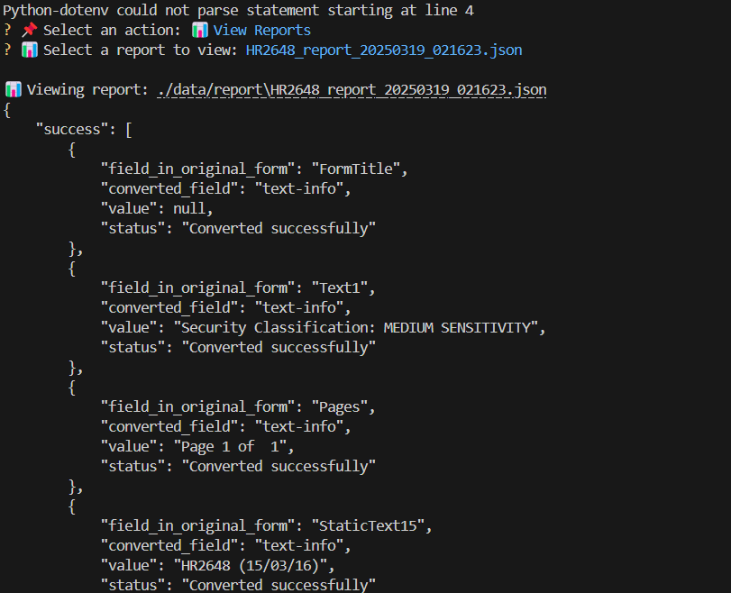

# XML to JSON Converter

## 📖 Overview

The **XML to JSON Converter** is a command-line tool designed to convert XFA-based XML forms and Orbeon XML forms into JSON format. It supports **single file conversion** as well as **batch processing** of multiple XML files.

---

## 🚀 Installation

To install the required dependencies, run:

```sh
pip3 install -r requirements.txt
```

---

## 🚀 Running the XML Converter

### **1️⃣ Main Menu**

When you run the script, you will see a menu with different options:

```sh
python xdp_converter_cli.py
```



---

### **2️⃣ Convert a Single XDP File**

- Select the option to convert a single XDP file.
- Choose the file you want to convert.
- The converted JSON and report files will be saved in the respective directories.

```sh
? Select an action: 📄 Convert a Single XDP File
```



---

### **3️⃣ Batch Process Multiple Files**

- Select the batch processing option.
- Define the input and output directories.
- The tool will process all XDP files in the input directory and generate corresponding JSON and report files.

```sh
? Select an action: 📂 Batch Process Multiple Files
```



---

### **4️⃣ Process Files with Klamm Import Format**

- Select the option to process files with Klamm import format.
- Choose the input directory containing the XML files.
- The tool will convert all files in the directory to the Klamm import format and save them in the output directory.

```sh
? Select an action:  Single Klamm Format Extraction
```

```sh
? Select an action:  Batch Klamm Format Extraction
```

## 🚀 Running the Orbeon XML Converter

The Orbeon converter is a separate tool specifically designed to convert Orbeon Forms XML to JSON:

### **Using the CLI tool**

```sh
python src/orbeon_converter_cli.py -i /path/to/input.xml [-m /path/to/mapping.json] [-o /path/to/output.json] [-v]
```

**Options:**

- `-i, --input`: Path to input Orbeon XML file (required)
- `-m, --mapping`: Path to XML field mapping file (defaults to xml_mapping.json in project root)
- `-o, --output`: Path to output JSON file (defaults to auto-generated filename in the output directory)
- `-v, --verbose`: Enable verbose output

### **Using the test script**

For a quick test with the sample CF2160.xml file:

```sh
python test_orbeon_converter.py
```

---

## 📂 Input, Output & Report Paths

The tool uses the following environment variables (or defaults) for directory paths:

```python
INPUT_DIR = os.getenv("INPUT_DIR", "./data/input")
OUTPUT_DIR = os.getenv("OUTPUT_DIR", "./data/output")
REPORT_DIR = os.getenv("REPORT_DIR", "./data/report")
```

- **Input Directory**: `./data/input` (Contains the XML/XDP files to be converted)
- **Output Directory**: `./data/output` (Converted JSON files are stored here)
- **Report Directory**: `./data/report` (Conversion reports are stored here)

---

## 📄 Report Generation

After conversion, a detailed report is generated for each file. The report includes:

- ✅ **Successful conversions**
- ❌ **Errors encountered**
- ⚠️ **Cases requiring manual intervention**

The report is saved in the **report directory**.



---

## 🔄 Supported XML Formats

This tool supports two types of XML form formats:

1. **XFA-based XML/XDP Forms** - Forms created with Adobe LiveCycle/AEM Forms
2. **Orbeon XML Forms** - Forms created with Orbeon Forms Platform

Both formats are converted to a standardized JSON structure that can be used by modern frontend applications.

---

## 📄 Additional Documentation

For a detailed explanation of reports and error handling, refer to the full documentation.

---

### 🔗 **Contributors & Support**

If you encounter any issues, feel free to reach out or submit a pull request!

Happy Coding! 🚀
